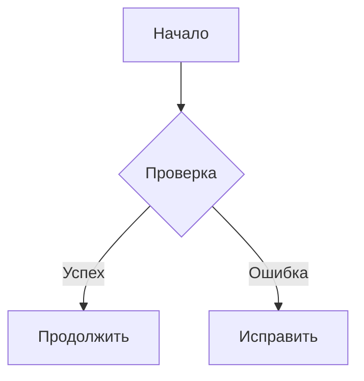

# 🖥️ Правила работы с документацией в Cursor IDE

## 🎯 Цель

Этот документ содержит правила и инструкции для работы с документацией Dubai Project в Cursor IDE. Cursor - это современный редактор кода с встроенным AI ассистентом, который может помочь в создании, редактировании и поддержании качественной документации.

## 🚀 Настройка Cursor для работы с документацией

### 📦 Установка расширений
```json
// Рекомендуемые расширения для Cursor
{
  "extensions": [
    "yzhang.markdown-all-in-one",           // Markdown поддержка
    "davidanson.vscode-markdownlint",       // Markdown линтинг
    "ms-vscode.vscode-markdown-preview-enhanced", // Улучшенный предпросмотр
    "bierner.markdown-emoji",               // Эмодзи поддержка
    "bierner.markdown-preview-github-styles", // GitHub стили
    "bierner.markdown-mermaid",             // Mermaid диаграммы
    "ms-vscode.powershell",                 // PowerShell поддержка
    "ms-vscode.vscode-json",                // JSON поддержка
    "redhat.vscode-yaml",                   // YAML поддержка
    "ms-vscode.vscode-docker"               // Docker поддержка
  ]
}
```

### ⚙️ Настройка Cursor
```json
// settings.json для Cursor
{
  "markdown.preview.breaks": true,
  "markdown.preview.fontSize": 14,
  "markdown.preview.lineHeight": 1.6,
  "markdown.preview.scrollPreviewWithEditor": true,
  "markdown.extension.toc.levels": "1..6",
  "markdown.extension.toc.orderedList": true,
  "markdown.extension.toc.updateOnSave": true,
  "markdown.extension.syntax.decorations": true,
  "markdown.extension.preview.autoShowPreviewToSide": true,
  "markdownlint.config": {
    "default": true,
    "MD013": { "line_length": 120 },
    "MD024": false,
    "MD033": false,
    "MD041": false
  }
}
```

## 🔧 Интеграция с AI ассистентом

### 💬 Использование AI для документации
```markdown
## Примеры запросов к AI ассистенту

## Создание документа
"Создай документацию для API endpoint /api/v1/users с примерами на Python и JavaScript"

## Редактирование документа
"Исправь грамматические ошибки в этом документе и улучши структуру"

## Перевод документа
"Переведи этот документ на русский язык, сохранив техническую терминологию"

## Проверка качества
"Проверь этот документ на соответствие правилам Dubai Project и предложи улучшения"
```

### 🎯 Лучшие практики работы с AI
- **Конкретные запросы**: Четко формулируйте, что нужно сделать
- **Контекст**: Предоставляйте AI информацию о существующей структуре
- **Проверка**: Всегда проверяйте результат работы AI
- **Итерации**: Используйте AI для улучшения документации пошагово

## 📝 Рабочий процесс в Cursor

### 🆕 Создание нового документа
1. **Создание файла**: `Ctrl+N` → сохранить как `.md`
2. **Выбор шаблона**: Использовать шаблоны из `CONTRIBUTING.md`
3. **AI помощь**: Попросить AI создать структуру документа
4. **Наполнение**: Заполнить содержимое по разделам
5. **Проверка**: Запустить линтинг и предпросмотр

### ✏️ Редактирование существующего документа
1. **Открытие**: `Ctrl+O` → выбрать `.md` файл
2. **Анализ**: Изучить текущую структуру
3. **Планирование**: Определить, что нужно изменить
4. **Редактирование**: Внести изменения с помощью AI
5. **Валидация**: Проверить результат

### 🔍 Предпросмотр и проверка
```bash
## Открыть предпросмотр Markdown
Ctrl+Shift+V

## Открыть предпросмотр рядом с редактором
Ctrl+K V

## Обновить предпросмотр
Ctrl+Shift+P → "Markdown: Refresh Preview"
```

## 🛠️ Инструменты и команды

### ⌨️ Горячие клавиши
```markdown
| Действие | Горячие клавиши |
|----------|------------------|
| Создать заголовок | Ctrl+Shift+6 |
| Создать список | Ctrl+Shift+L |
| Создать таблицу | Ctrl+Shift+T |
| Вставить ссылку | Ctrl+Shift+L |
| Вставить изображение | Ctrl+Shift+I |
| Предпросмотр | Ctrl+Shift+V |
| Предпросмотр рядом | Ctrl+K V |
| Свернуть/развернуть | Ctrl+Shift+[ / ] |
```

### 🔧 Markdown команды
```markdown
## Автодополнение Markdown
- Введите `#` и пробел для заголовка H1
- Введите `##` и пробел для заголовка H2
- Введите `-` и пробел для списка
- Введите `1.` и пробел для нумерованного списка
- Введите `[` для создания ссылки
- Введите `![` для вставки изображения
```

### 📊 Создание таблиц
```markdown
## Автоматическое создание таблиц
| Колонка 1 | Колонка 2 | Колонка 3 |
|------------|------------|------------|
| Данные 1   | Данные 2   | Данные 3   |

## Использование AI для создания таблиц
"Создай таблицу сравнения Docker и Kubernetes для документации"
```

## 🔍 Проверка качества

### ✅ Автоматические проверки
```bash
## Запуск markdownlint
Ctrl+Shift+P → "Markdown: Run Linter"

## Проверка орфографии
Ctrl+Shift+P → "Spell Checker: Enable Spell Checker"

## Проверка ссылок
Ctrl+Shift+P → "Markdown: Check Links"
```

### 🧪 Ручные проверки
- [ ] Структура документа логична
- [ ] Все примеры кода работают
- [ ] Ссылки актуальны и работают
- [ ] Язык понятен целевой аудитории
- [ ] Документ покрывает все аспекты темы

### 📋 Чек-лист качества
```markdown
## Чек-лист перед коммитом
- [ ] Документ проходит markdownlint без ошибок
- [ ] Предпросмотр отображается корректно
- [ ] Все ссылки работают
- [ ] Примеры кода синтаксически корректны
- [ ] Структура заголовков логична
- [ ] Язык соответствует правилам проекта
```

## 🎨 Стилизация и форматирование

### 🌈 Эмодзи и иконки
```markdown
## Использование эмодзи для улучшения читаемости
🚀 Быстрый старт
📚 Документация
🔧 Настройка
⚠️ Предупреждение
✅ Успех
❌ Ошибка
💡 Совет
🔍 Поиск
📊 Мониторинг

## Вставка эмодзи в Cursor
Ctrl+Shift+P → "Emoji: Insert Emoji"
```

### 📐 Таблицы и диаграммы
```markdown
## Создание красивых таблиц
| Функция | Статус | Приоритет |
|---------|--------|-----------|
| API Docs | ✅ Готово | Высокий |
| User Guide | 🚧 В работе | Средний |
| Troubleshooting | ❌ Не начато | Низкий |

## Mermaid диаграммы

```

### 🎯 Цветовое кодирование
```markdown
## Использование цветов для статусов
- <span style="color: green;">✅ Готово</span>
- <span style="color: orange;">🚧 В работе</span>
- <span style="color: red;">❌ Не начато</span>
- <span style="color: blue;">💡 Идея</span>
```

## 🔄 Интеграция с Git

### 📝 Git workflow для документации
```bash
## Создание ветки для документации
git checkout -b docs/feature-name

## Добавление изменений
git add docs/
git commit -m "docs: добавить руководство по API"

## Push и создание Pull Request
git push origin docs/feature-name
```

### 📋 Commit message conventions
```markdown
## Формат commit сообщений для документации
docs: добавить руководство по развертыванию
docs: обновить API документацию
docs: исправить грамматические ошибки
docs: добавить примеры использования
docs: реструктурировать навигацию
```

### 🔍 Code review для документации
```markdown
## Чек-лист для review документации
- [ ] Документ следует правилам проекта
- [ ] Структура логична и понятна
- [ ] Примеры кода работают
- [ ] Ссылки актуальны
- [ ] Язык соответствует стандартам
- [ ] Нет дублирования информации
```

## 🚀 Продвинутые возможности

### 🤖 AI-ассистированное создание документации
```markdown
## Использование AI для различных задач

## Создание структуры
"Создай структуру документа для руководства по Docker развертыванию"

## Генерация примеров
"Сгенерируй примеры использования API для Python и JavaScript"

## Перевод технических терминов
"Переведи технические термины на русский язык"

## Проверка качества
"Проверь этот документ на соответствие правилам Dubai Project"
```

### 📊 Автоматизация
```markdown
## Автоматические задачи

## Генерация оглавления
Ctrl+Shift+P → "Markdown: Generate Table of Contents"

## Автоформатирование
Ctrl+Shift+P → "Format Document"

## Проверка ссылок
Ctrl+Shift+P → "Markdown: Check All Links"

## Экспорт в другие форматы
Ctrl+Shift+P → "Markdown: Export to PDF/HTML"
```

### 🔗 Интеграция с внешними сервисами
```markdown
## Подключение к внешним сервисам

## GitHub
- Автоматическая синхронизация
- Pull Request интеграция
- Issue tracking

## MkDocs
- Автоматическая сборка
- Предпросмотр изменений
- Деплой на GitHub Pages

## CI/CD
- Автоматическая проверка качества
- Тестирование ссылок
- Валидация структуры
```

## 🚨 Решение проблем

### ❌ Частые проблемы и решения

#### Проблема: Markdown не отображается корректно
**Решение**:
1. Проверьте расширения Markdown
2. Перезапустите Cursor
3. Проверьте настройки preview

#### Проблема: AI ассистент не работает
**Решение**:
1. Проверьте подключение к интернету
2. Убедитесь в правильности API ключей
3. Перезапустите Cursor

#### Проблема: Linter показывает много ошибок
**Решение**:
1. Проверьте конфигурацию `.markdownlint.json`
2. Используйте AI для исправления ошибок
3. Следуйте правилам из `CONTRIBUTING.md`

### 🆘 Получение помощи
```markdown
## Источники помощи

## Документация Cursor
- [Cursor Documentation](https://cursor.sh/docs)
- [Cursor AI Guide](https://cursor.sh/docs/ai)

## Сообщество
- [GitHub Issues](https://github.com/dubai-project/docs/issues)
- [Discord Server](https://discord.gg/dubai-platform)

## Внутренние ресурсы
- [CONTRIBUTING.md](./CONTRIBUTING.md)
- [GPT_RULES.md](./GPT_RULES.md)
- [README.md](./README.md)
```

## 📈 Лучшие практики

### 🎯 Эффективность работы
- **Используйте AI** для рутинных задач
- **Автоматизируйте** проверки качества
- **Следуйте стандартам** проекта
- **Регулярно обновляйте** документацию

### 🔄 Непрерывное улучшение
- **Собирайте обратную связь** от пользователей
- **Анализируйте метрики** использования
- **Тестируйте документацию** на разных аудиториях
- **Обновляйте правила** на основе опыта

### 🚀 Инновации
- **Экспериментируйте** с новыми форматами
- **Используйте интерактивные** элементы
- **Интегрируйте** с современными инструментами
- **Адаптируйтесь** к потребностям пользователей

---

**Последнее обновление**: {{ date }}  
**Версия**: 1.0.0  
**Автор**: Dubai Documentation Team  
**Цель**: Оптимизировать работу с документацией в Cursor IDE

