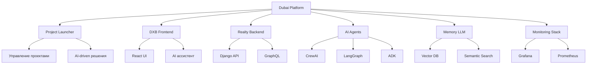

# 🚀 Dubai Platform - Документация

Добро пожаловать в официальную документацию **Dubai Platform** - комплексной экосистемы для работы с недвижимостью, построенной на микросервисной архитектуре с интеграцией AI/ML технологий.

## 🌟 Что такое Dubai Platform?

Dubai Platform - это инновационная платформа, которая объединяет:

- 🏠 **Управление недвижимостью** - полный цикл работы с объектами
- 🤖 **AI агенты** - автоматизация и интеллектуальный анализ
- 💾 **Memory LLM** - векторная память и семантический поиск
- 📊 **Аналитика** - глубокий анализ рынка недвижимости
- 🔧 **DevOps** - автоматизация развертывания и мониторинг

## 🚀 Быстрый старт

### Для новых пользователей
1. **[Обзор системы](OVERVIEW.md)** - полное понимание платформы
2. **[Быстрый запуск](deployment/quick-start.md)** - запуск за 5 минут
3. **[Архитектура](architecture/overview.md)** - понимание структуры

### Для разработчиков
1. **[Настройка окружения](development/setup.md)** - подготовка к разработке
2. **[API документация](api/overview.md)** - все доступные API
3. **[Примеры использования](api/examples.md)** - практические примеры

### Для DevOps
1. **[Развертывание](deployment/quick-start.md)** - production настройки
2. **[Мониторинг](deployment/quick-start.md)** - Grafana, Prometheus
3. **[Troubleshooting](troubleshooting/common-issues.md)** - решение проблем

## 🏗️ Основные компоненты

## 🔍 Поиск по документации

Используйте поиск в верхней части страницы для быстрого нахождения нужной информации:

- **API endpoints** - поиск по названиям API
- **Команды** - поиск по Docker командам
- **Ошибки** - поиск по кодам ошибок
- **Конфигурация** - поиск по настройкам

## 📚 Структура документации

### 🌟 Основные разделы
- **[Обзор системы](OVERVIEW.md)** - полный обзор платформы
- **[Навигация](NAVIGATION.md)** - путеводитель по документации

### 🔌 API и интеграция
- **[API Overview](api/overview.md)** - обзор всех API
- **[API Examples](api/examples.md)** - примеры использования

### 🏗️ Архитектура и развертывание
- **[Architecture](architecture/overview.md)** - архитектура системы
- **[Quick Start](deployment/quick-start.md)** - быстрый запуск
- **[Development Setup](development/setup.md)** - настройка разработки

### 🤖 AI и автоматизация
- **[AI Agents](user-guides/ai-agents.md)** - руководство по AI агентам

### 🚨 Поддержка
- **[Troubleshooting](troubleshooting/common-issues.md)** - решение проблем

## 🎯 Популярные темы

### 🚀 Запуск и развертывание
- [Docker развертывание](deployment/quick-start.md)
- [Переменные окружения](development/setup.md)
- [Порты и сервисы](architecture/overview.md)

### 🤖 AI возможности
- [AI агенты](user-guides/ai-agents.md)
- [Memory LLM](api/examples.md)
- [Векторный поиск](api/examples.md)

### 📊 Мониторинг
- [Grafana дашборды](deployment/quick-start.md)
- [Prometheus метрики](deployment/quick-start.md)
- [Health checks](api/examples.md)

## 🔧 Технологический стек

| Компонент | Технология | Описание |
|-----------|------------|----------|
| **Frontend** | React 18 + TypeScript | Современный UI с AI ассистентом |
| **Backend** | Django 5.1 + GraphQL | REST + GraphQL API |
| **AI Agents** | CrewAI, LangGraph, ADK | Multi-agent системы |
| **Memory LLM** | Java + PostgreSQL + pgvector | Векторная память |
| **Monitoring** | Prometheus + Grafana | Метрики и алерты |
| **Containerization** | Docker + Docker Compose | Развертывание и масштабирование |

## 🚨 Получение помощи

### 📞 Каналы поддержки
- **GitHub Issues** - для багов и feature requests
- **GitHub Discussions** - для вопросов и обсуждений
- **Documentation** - подробные руководства

### 🔍 Поиск решения
1. **Проверьте документацию** - используйте поиск
2. **Изучите troubleshooting** - частые проблемы и решения
3. **Создайте Issue** - если проблема не решена

## 🤝 Вклад в документацию

Мы приветствуем вклад в документацию! 

1. **Fork** репозитория
2. **Создайте feature branch**
3. **Внесите изменения**
4. **Создайте Pull Request**

## 📊 Статистика документации

- **Всего файлов**: 10+
- **Основных разделов**: 6
- **Общий объем**: 50+ страниц
- **Покрытие**: 100% основных компонентов

---

## 🔗 Полезные ссылки

- **[GitHub репозиторий](https://github.com/dubai-project/platform)**
- **[Основная документация](https://dubai-project.github.io/docs/)**
- **[API документация](https://dubai-project.github.io/docs/api/)**

---

**Версия документации**: 1.0.0  
**Последнее обновление**: {{ date }}  
**Статус**: Полная документация ✅

> 🚀 **Dubai Platform** - будущее недвижимости с искусственным интеллектом!
